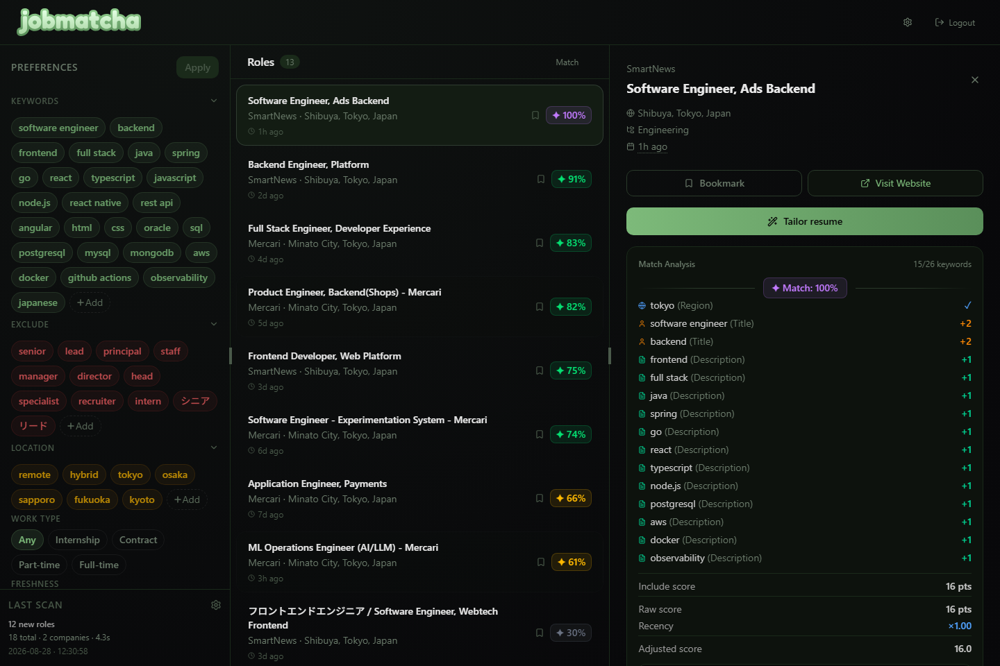

<p align="center">
  
</p>

<p align="center">
  <strong>Turn a noisy job search into a shortlist worth opening.</strong><br />
  A private, self-hosted job tracker that scans a seeded company set and ranks roles around what you want next.
</p>

<p align="center">
  <a href="https://github.com/Caslus/jobmatcha/actions/workflows/test.yml"></a>
  <a href="LICENSE"></a>
</p>



Jobmatcha scans a seeded set of company career sites and turns them into an explainable, preference-based shortlist. The implemented scanners support Greenhouse and Workable. Your data lives in your own SQLite volume—there is no hosted account, analytics script, or required AI subscription.

## Start in two minutes

```bash
git clone https://github.com/Caslus/jobmatcha.git
cd jobmatcha
docker compose up -d
docker compose exec jobmatcha cat /data/initial-password
```

Open [http://localhost:8181](http://localhost:8181), sign in with the generated password, and complete onboarding. Your data stays in the `jobmatcha-data` Docker volume.

## Documentation

The full documentation is a Starlight project in [`docs/`](docs/README.md). Until it has a public URL, GitHub renders the source guides directly:

- [Docker Compose and first scan](docs/src/content/docs/get-started/docker-compose.md)
- [Relevance, schedules, and AI privacy](docs/src/content/docs/guides/relevance.md)
- [Deployment, HTTPS, backups, and configuration](docs/src/content/docs/get-started/operating/deployment.md)
- [Local development and documentation assets](docs/src/content/docs/developers/development.md)

## Under the hood

- **Frontend:** React 19, TanStack Start/Router/Query, Tailwind CSS
- **Backend:** Go, Gin, GORM, SQLite
- **Delivery:** local multi-stage container build; the release workflow is prepared to publish multi-architecture images when releases are available.

## Community

Jobmatcha is MIT licensed and built in the open. Contributions, provider integrations, and documentation improvements are welcome.

- [Contributing guide](CONTRIBUTING.md)
- [Code of Conduct](CODE_OF_CONDUCT.md)
- [Security policy](SECURITY.md)
- [MIT License](LICENSE)
